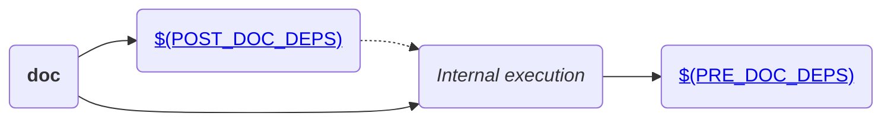

# doxygen.mk

This file provides standard targets to generate source documentation using [doxygen](https://www.doxygen.nl/index.html).

## Basic usage

If your project contains a `Doxyfile`, include this makefile into your project's `Makefile`.

```Makefile
include $(CPB_DIR)/doxygen.mk
```

Once this makefile is included, documentation can be generated by calling

```bash
make doc
```

Generated documentation will placed into [`$(O_DOC_DIR)`](#o_doc_dir) directory.


## Make targets

The following diagram shows all targets exposed by this makefile and their dependencies:

!!! note
    Dashed lines represent execution of one target after another, and not a dependency between targets.



## Variables

Following are described all variables used/exported by this makefile:

!!! note "Variable details"
    For each detailed variable, the following fields refer to:

    * **Description:** Contains descriptive information about the variable.

    * **Required:** Defines if a variable must be defined (and it must be non-empty) during build.

    * **Default value:** Contains the value which will be assumed if variable is optional and it is not defined.

    * **Mutable:** Some variables defined in makefiles can be updated by the build system. This field explain details about how such variables can be modified by the build system.

    * **Origins:** Contains the list of allowed origins for variable definition.

    * **Restrictions:** Contains information about restrictions on which kind of values that can be stored in the variable.

### Input variables

The following variables controls how documentation should be generated:

#### DOC_DIR

* **Description:** Defines the path of the directory (relative to [output directory](../user-guide/#output-directories)), which will contain generated documentation.
* **Required:** No
* **Default value:** `doc`
* **Origins:** _(any)_.
* **Restrictions:** Value shall not contain whitespaces nor can be an empty string.

#### DOXYFILE

* **Description:** Defines the path of the `Doxyfile` which will be parsed by doxygen.
* **Required:** No
* **Default value:** `Doxyfile`
* **Origins:** _(any)_
* **Restrictions:** Value shall not contain whitespaces nor can be an empty string.

#### POST_DOC_DEPS

* **Description:** Contains a list of targets to be called AFTER documentation is generated.
* **Required:** No
* **Default value:** _(undefined)_
* **Origins:** makefile
* **Restrictions:** Since variable is intended to hold a list of values (whitespace-delimited string), it is recommend to use the `+=` operator while adding values to the variable.

#### PRE_DOC_DEPS

* **Description:** Contains a list of targets to be called BEFORE documentation is generated.
* **Required:** No
* **Default value:** _(undefined)_
* **Origins:** makefile
* **Restrictions:** Since variable is intended to hold a list of values (whitespace-delimited string), it is recommend to use the `+=` operator while adding values to the variable.

### Output variables

The following variables are generated automatically by this makefile:

#### O_DOC_DIR

* **Description:** Read-only variable containing the final directory where generated documentation will be placed (`$(O)/$(DOC_DIR)`).
* **Required:** _(Not applicable)_
* **Default value:** _(Not applicable)_
* **Origins:** _(Not applicable)_
* **Restrictions:** This is a read-only reserved variable.
