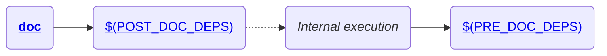

# doxygen.mk

This makefile provides a target to generate source documentation using [doxygen](https://www.doxygen.nl/index.html).

--------------------------------------------------------------------------------

## Basic usage

If your project contains a `Doxyfile`, and you want to automate the invocation of `doxygen`, include this makefile:

```Makefile
include $(CPB_DIR)/doxygen.mk
```

Once this makefile is included, documentation can be generated by calling

```bash
make doc
```

Generated documentation will be placed into [`$(DOC_DIR)`](#doc_dir) directory.

--------------------------------------------------------------------------------

## Make targets

The following diagram shows all targets exposed by this makefile and their dependencies:

!!! note
    Dashed lines represent execution of one target after another, and not a dependency between them.


<br/>

### doc

This target will trigger [doxygen](https://www.doxygen.nl/index.html) to generate documentation by parsing [provided Doxyfile](#doxyfile).

--------------------------------------------------------------------------------

## Variables

Following are described all variables used/exported by this makefile:

!!! note "Variable details"
    For each detailed variable, the following fields refer to:

    * **Description:** Contains descriptive information about the variable.

    * **Required:** Defines if a variable must be defined (and it must be non-empty) during build.

    * **Default value:** Contains the value which will be assumed if variable is optional and it is not defined.

    * **Origins:** Contains the list of allowed origins for variable definition.

    * **Restrictions:** Contains information about restrictions on which kind of values that can be stored in the variable.

!!! Warning
    The build system declare internal private variables and functions that are not intended to be used by projects. All of those private variables and functions, have their names prefixed with `cpb_` prefix. Please avoid using/defining variables or functions with names beginning with such prefix.

    The build system checks for attempts to define variables and functions with the same name of reserved ones. Any attempt to define such items will result in errors being raised by the build system.

### Input variables

The following variables controls how documentation should be generated:

#### DOC_DIR

* **Description:** Defines the path of the directory, which will contain generated documentation.
* **Required:** No.
* **Default value:** <tt style="color:#E74C3C">[$(O_BASE)](../variables/#o_base)/doc</tt>.
* **Origins:** Makefile.
* **Restrictions:** Value shall not contain whitespaces nor can be an empty string.

--------------------------------------------------------------------------------

#### DOXYFILE

* **Description:** Defines the path of the `Doxyfile` which will be parsed by doxygen.
* **Required:** No.
* **Default value:** `Doxyfile`.
* **Origins:** Makefile.
* **Restrictions:** Value shall not contain whitespaces nor can be an empty string.

!!! Note
    The doxygen variable `OUTPUT_DIRECTORY` will always be overriden when calling the [doc target](#doc) (see [DOXYVARS](#doxyvars)).

--------------------------------------------------------------------------------

#### DOXYVARS

* **Description:** List of variables definitions overriding the contents of [DOXYFILE](#doxyfile).
* **Required:** No.
* **Default value:** The value `\nOUTPUT_DIRECTORY = \"$(DOC_DIR)\"\n` will always be appended to the variable.
* **Origins:** Makefile.
* **Restrictions:** Since the contents of this variable will be printed using shell's `printf` command, be sure to escape new lines and quotes correctly.

--------------------------------------------------------------------------------

#### POST_DOC_DEPS

* **Description:** Contains a list of targets to be called AFTER documentation is generated.
* **Required:** No.
* **Default value:** Undefined.
* **Origins:** Makefile.
* **Restrictions:** None.

--------------------------------------------------------------------------------

#### PRE_DOC_DEPS

* **Description:** Contains a list of targets to be called BEFORE documentation is generated.
* **Required:** No.
* **Default value:** Undefined.
* **Origins:** Makefile.
* **Restrictions:** None.

--------------------------------------------------------------------------------

### Output variables

_This makefile does not expose any variable._

--------------------------------------------------------------------------------

## Functions

_This makefile does not expose any function._
