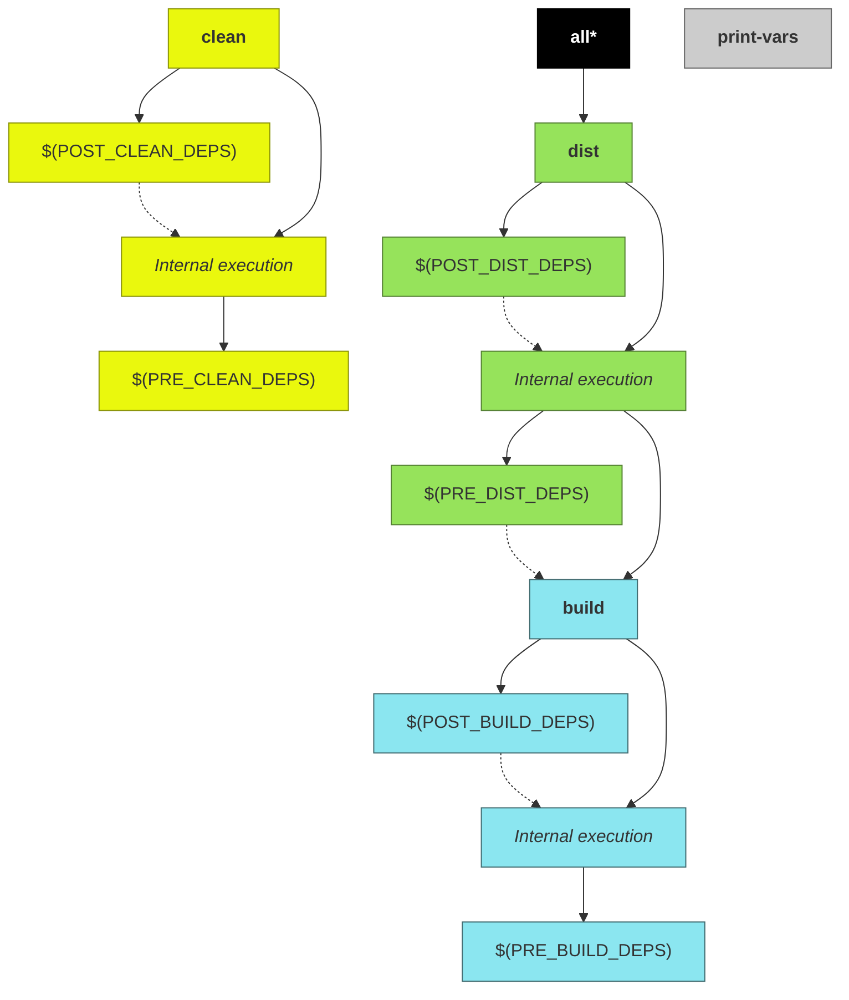

!!! danger "Review status: IN PROGRESS"

# User guide

Basically, when `builder.mk` is included, it expects certain variables to be defined, and according to their values, the project build process can be customized.

!!! note
    Before reading this document, ensure you have read the [basic usage](/#basic-usage) instructions.

## Checking compatibility

When using a shared build system, it is recommend to check if build system provides all the features expected by your project.

!!! note
    If you are embedding the build system directly into your project source tree, usually there is no need to check for build system version compatibility.

In order to check if a shared build system is supported by your project, define the variable [`CPB_MIN_VERSION`](../variables/#cpb_min_version) with the minimum accepted version.

If shared build system's is incompatible with the minimum expected version, a fail will be raised.

For example, if your project defines:

```makefile
CPB_MIN_VERSION = 1.0.2
```

The compatibility for the following build system versions would be:

| Build system version | Compatibility                            |
|----------------------|------------------------------------------|
| 1.0.**1**            | Rejected (older version)                 |
| 1.0.2                | Accepted (same version)                  |
| 1.0.3                | Accepted (Newer version)                 |
| **2**.0.0            | Rejected (major version is incompatible) |

## Project attributes

### Project name

Every project using the build system has to provide its a name. The way in which a project name is defined is via the variable [`PROJ_NAME`](../variables/#proj_name).

The build system will use the project name, among other things, to define the name of artifacts that are generated during the build process.

!!! notes
    The filename of generated artifacts may vary according to [selected host](#multiplatform-projects).

    Although it is a good idea to accept default generated names, you may change the name of generated artifacts through the use of any of the following variables:

    * [`ARTIFACT`](../variables/#artifact)
    * [`LIB_NAME`](../variables/#lib_name)

### Project type

Along with project name, the project type is required by the build system. It defines the kind of artifact to be built. It can be a library or an application.

In order to define the type of artifact to be built, define the variable [`PROJ_TYPE`](../variables/#proj_type).

If your makefile intends to build a library, you can define the type of library being built (static or shared) by defining the variable [`LIB_TYPE`](../variables/#lib_type).

## Directories and files

From this point onwards, the project root directory will be referred to as `<PROJ_ROOT>` and it is the directory where project's `Makefile` is located.

!!! Warning
    The absolute path of `<PROJ_ROOT>` cannot have white-spaces.

### Input directories and files

The build system uses the contents of certain directories to perform the build. Some of these directories are automatically detected by the build system, and others may be manually informed by the project through its makefiles.

#### &lt;PROJ_ROOT>/include

When present, this directory is automatically added to compiler's [include search path](../variables/#include_dirs). It is intentended to contain public header files used by the application.

!!! notes "Adding directories to compiler search path using compiler flags"
    The variables [`CFLAGS`](../variables/#cflags) and [`CXXFLAGS`](../variables/#cxxflags) can be used to add directories to compiler search path, but keep in mind that each variable applies accordingly to the type of source file being built ([`CFLAGS`](../variables/#cflags) for C, and [`CXXFLAGS`](../variables/#cxxflags) for C++), and you have to know the exact way of adding directories to compilers' search path.

    For example, in order to add directories to GCC search path, you have to use the `-I` parameter.

	So, in order to pass these parameters to the compilers, define the variables like this:

        CFLAGS += -Idirectory1
        CXXFLAGS += -Idirectory1

If you want to have multiple directories being added to compiler's search path, add entries to [`INCLUDE_DIRS`](../variables/#include_dirs) variable.

!!! warning "Skip default include directory detection"
    If the variable [`INCLUDE_DIRS`](../variables/#include_dirs) is defined, there will be no automatic detection of `<PROJ_ROOT>/include`.

!!! notes
    If project is a library, `<PROJ_ROOT>/include` is present, and `INCLUDE_DIRS` is not set, then this directory will be automatically added to the list of [distribution directories](../variables/#dist_dirs).


#### &lt;PROJ_ROOT>/src

When present, this directory is intended to have platform-independent source files (or platform-specific, if your project does not mean to support multiple platforms), and private headers used by application during build.

Any kind of file can be placed into this directory, but only C/C++/Assembly source files will be recognized to be compiled. The file types are identified according their filename suffixes (values are case-sensitive):

* C sources: `*.c`
* C++ sources: `*.cpp`, `*.cxx`, or `*.cc`
* Assembly sources: `*.s` or `*.S`

Addictional source directories and files can be added by defining the variables [`SRC_DIRS`](../variables/#src_dirs) and/or [`SRC_FILES`](../variables/#src_files).

This directory is also added to compiler's [include search path](../variables/#include_dirs).

!!! warning "Skip default source directory detection"
    Similarly to [`INCLUDE_DIRS`](../variables/#include_dirs), if either [`SRC_DIRS`](../variables/#src_dirs) or [`SRC_FILES`](../variables/#src_files) are defined, the default source directory is not automatically detected.

#### &lt;PROJ_ROOT>/hosts

When present, this directory is assumed to contain platform layers for the project.

If you want to have platforms layers spread across multiple directories, add entries to [`HOSTS_DIRS`](../variables/#hosts_dirs).

For details about what platform layers are and how to use them in oder to add support to multiple platforms in your project, see [multiplatform projects](#multiplatform-projects).

#### Custom sources

TODO

### Output directories and files

All files produced by the building process are placed into an output directory (defined by the variable [`O`](#O)).

By default, this directory is located into `$(O_BASE)/$(HOST)/<debug or release>`.

!!! notes "Output-base directory"
    If the variable [`O`](#O) is not defined, the output-base directory (defined in variable [`O_BASE`](../variables/#o_base)) is `<PROJ_ROOT>/output`. If variable [`O`](#O) is manually defined, the value of [`O_BASE`](../variables/#o_base) will be the same of [`O`](#O).

    Since this directory contains files produced while building the project, it is strongly recommened to ignore it in your version control system.

For example, in order to put generated files into directory `./result` (NOTE: paths are always relative to current working directory), just set the [`O`](#O) variable (either in a makefile, or via command-line). Via command-line, the call to `make` would be:

```sh
make O=result
```

Inside the output directory ([`O`](../variables/#o)), you may find the following directories:

#### $(O)/build

This is the build directory. This directory contains object files as well as the final artifact (application executable or library).

Files are put into this directory during the execution of [`build`](#build) target.

This path can be referred to by the variable [`O_BUILD_DIR`](#O_BUILD_DIR).

#### $(O)/dist

Distribution directory. Final artifact (executable or library), and possibly companion files (e.g. header files, for libraries) are placed into this directory.

Files are put into this directory during the execution of [`dist`](#dist) target.

This path can be referred to by the variable [`O_DIST_DIR`](#O_DIST_DIR).

If you want to add additional files and/or directories to the distribution directory (e.g. images, configuration files, etc), use the variables [`DIST_FILES`](../variables/#dist_files) and/or [`DIST_DIRS`](../variables/#dist_dirs).

##### $(O)/dist/bin

If the project is an [application executable](../variables/#proj_type), generated executable will be placed into this directory.

##### $(O)/dist/lib

If the project is a [library](../variables/#proj_type) (either [static or shared](../variables/#lib_type)), generated library will be placed into this directory.

##### $(O)/dist/include

If the project is a [library](../variables/#proj_type) (either [static or shared](#LIB_TYPE)), [public headers](#proj_rootinclude) (if present) will be placed into this directory.

## Customizing the build

Although you can fully configure the the way in which your project will be built entirely in your project's makefile, there are some aspects that would be more interesting to change just for a specific build.

### Debug vs. Release

By default, built artifacts are generated in release mode (i.e. without any debugging symbols and with some [compiler optimizations](#compiler-optimizations)). If you want to build your artifacts in debug mode (i.e. with debugging symbols and without any compiler optimizations), you have to change the variable [`DEBUG`](../variables/#debug).

It could be perfeclty fine to force every compilation to be in debug mode by setting the corresponding variable in your project's makefile, but it would be more interesting to let the developer or CI/CD system to customize it in the moment the project is being built.

In order to allow customizations, pass the [`DEBUG`](../variables/#debug) variable as command-line arguments during the build:

```bash
make DEBUG=1
```

### Compiler optimizations

When your project is being built in [debug mode](#debug-vs-release), by default no compiler optmizations would be applied. In the other hand, when your project is being built in release mode (this is the default mode), some compiler optimizations will be applied and binaries will be stripped by default.

If you want to customize the optimizations done while building in release mode, the following variables can be used:

* [`STRIP_RELEASE`](../variables/#strip_release)
* [`OPTIMIZE_RELEASE`](../variables/#optimize_release)
* [`RELEASE_OPTMIZATION_LEVEL`](../variables/#release_optimization_level)

### Library type

When building a library, two kinds of artifacts can be built: _shared libraries_ or _static libraries_.

The library type is set through the variable [`LIB_TYPE`](../variables/#lib_type).

Although it would be perfectly fine to enforce (via makefiles) the generated library type to be of a certain kind, it is more interesting to let the the type to be defined during build time.

For example, if you want to generate an **static** library in **debug** mode, call `make` defining associated variables as command-line args:

```bash
make LIB_TYPE=static DEBUG=1
```

### Verbose mode

By default, when your project is being built, only basic output is generated by the build system.

This is a typical output generated during a build:

```plain
[CC] output/linux-x64/release/build/src/main.c.o
[LD] output/linux-x64/release/build/hello
[DIST] output/linux-x64/release/dist/bin/hello
```

If you want to see the real commands and corresponding flags while compiling/linking files, enable the **verbose mode** by setting the variable [`V`](../variables/#v):

```bash
make V=1
```

This is the output generated while building the same project from above:

```plain
[CC] output/linux-x64/release/build/src/main.c.o
gcc -MMD -MP -Isrc -Wall -O2 -s -c src/main.c -o output/linux-x64/release/build/src/main.c.o

[LD] output/linux-x64/release/build/hello
gcc -o output/linux-x64/release/build/hello output/linux-x64/release/build/src/main.c.o -s

[DIST] output/linux-x64/release/dist/bin/hello
/bin/cp output/linux-x64/release/build/hello output/linux-x64/release/dist/bin/hello
```

!!! note "Checking compiler flags and variable values"
    If you want to check what would be the values used by the build system
    without actually triggering the build, use the make target [`print-vars`](#print-vars)

### Output directory

See [output directories](#output-directories).

### Selecting a host

See [multiplatform projects](#multiplatform-projects).


## Make targets

The following diagram shows all targets exposed by this makefile and their dependencies:

!!! note
    Dashed lines represent execution of one target after another, and not a dependency between them.



### all

Default target. Just depends on [dist](#dist) target.

### clean

Removes all compiled artifacts.

Its internal rules are preceeded by the targets declared in [`PRE_CLEAN_DEPS`](#PRE_CLEAN_DEPS) variable, and are followed by the targets declared in [`POST_CLEAN_DEPS`](#POST_CLEAN_DEPS) variable.

### build

Compiles all source files and generates the target binary artifact (executable application or library).

Its internal rules are preceeded by the targets declared in [PRE_BUILD_DEPS](#PRE_BUILD_DEPS) variable, and are followed by the targets declared in [`POST_BUILD_DEPS`](#POST_BUILD_DEPS) variable.

!!! notes
    If project does not contain source files, no binary artifact will be generated (Howerver, targets declared in [PRE_BUILD_DEPS](#PRE_BUILD_DEPS) and [`POST_BUILD_DEPS`](#POST_BUILD_DEPS) will be executed)

### dist

Generate distribuition tree.

Its internal rules are preceeded by the targets declared in [PRE_DIST_DEPS](#PRE_DIST_DEPS) variable, and followed by dependencies declared on [POST_DIST_DEPS](#POST_DIST_DEPS) variable.

> See [`DIST_DIRS`](#DIST_DIRS) and [`DIST_FILES`](#DIST_FILES) in order to check how to add extra files/directories to the distribution.

### print-vars

This target is used mostly for debugging purposes. It prints the contents of the variables declared in variable [`VARS`](#VARS).

For example, to get the value of both [`SRC_DIRS`](#SRC_DIRS) and [`SRC_FILES`](#SRC_FILES):

```sh
make print-vars VARS='SRC_DIRS SRC_FILES'
```

Generates the following kind of output:

```plain
SRC_DIRS = src
SRC_FILES = src/main.c src/file1.c src/file2.c
```

If `VARS` is undefined, a bunch of variable's values will be displayed.

```sh
make print-vars
```

Output example:

```plain
AR = ar
ARTIFACT = hello0
AS = as
ASFLAGS = -MMD -MP -Isrc -Ioutput/libs/dist/include
CC = gcc
CFLAGS = -MMD -MP -Isrc -Ioutput/libs/dist/include -Wall -O2 -s -DUSE_SHARED_LIB
CROSS_COMPILE =
CXX = g++
CXXFLAGS = -MMD -MP -Isrc -Ioutput/libs/dist/include -Wall -O2 -s
DEBUG = 0
DIST_DIRS =
DIST_FILES =
DIST_MARKER =
HOST = linux-x64
HOSTS_DIRS = /home/user/Desktop/app/make/hosts
INCLUDE_DIRS = src output/libs/dist/include
LD = gcc
LDFLAGS = -s -Loutput/libs/dist/lib -lmylib0
LIB_TYPE = shared
O = output
O_BUILD_DIR = output/build
O_DIST_DIR = output/dist
POST_BUILD_DEPS =
POST_CLEAN_DEPS =
PRE_BUILD_DEPS = --mylib output/libs/mylib.marker
PRE_CLEAN_DEPS =
PRE_DIST_DEPS =
PROJ_NAME = hello
PROJ_TYPE = app
RELEASE_OPTIMIZATION_LEVEL = 2
SKIPPED_SRC_DIRS =
SKIPPED_SRC_FILES =
SKIP_DEFAULT_INCLUDE_DIR = 0
SKIP_DEFAULT_SRC_DIR = 0
SRC_DIRS = src
SRC_FILES = src/main.c
STRIP_RELEASE = 1
V = 0
```

## Multiplatform projects

The build system was created with the concept of platform layers in mind, which means that platform customizations can be made by adding a specifc layer on top of a generic one.

A layer is a directory containing makefile definitions and/or specific source files.

When a [HOST](#HOST) is specified, it will be factored to find supported layers. The value will be splitted by using the dash (`-`) character.

For example, if a [HOST](#HOST) `linux-arm-v6` is given, the following layers can be applicable if the corresponding directories are found in [layer directories](#layer-directories-and-files) (the layers are seached in following order):

* `linux`
* `linux/arm`
* `linux/arm/v6`
* `linux-arm-v6` (NOTE this is a the last applicable layer if present. Usage of this kind of layer is recommended only factorizing the layer does not make sense for your project)

In order to clarify the concepts, lets assume an example project which will be supporting the following hosts: `linux-x64`, and `linux-arm-v7`.

For this example project, the following layers are present (note that layer arrangement is up to the developer):

* `linux`
* `linux/x64`
* `linux/arm`
* `linux/arm/v7`


If you are compiling this example project to `linux-arm-v7` host, select the compilation host through [`HOST`](#HOST) variable. The recommended way is to set the variable through a command line paramenter (although is perfectly legal to hardcode a value into a `&lt;PROJ_ROOT>/Makefile`):

```sh
$ make HOST=linux-arm-v7
```

During the build, the following layers will be applied to this project:

| Layer          | Comments                                                                           |
|----------------|------------------------------------------------------------------------------------|
| `linux`        | _Linux generic definitions_                                                        |
| `linux/arm`    | _Adds specific definitions and/or override definitions of the `linux` layer_       |
| `linux/arm/v7` | _Adds specific definitions and/or override definitions of the `linux/arm` layer_   |

> Note that `linux/x64` layer will be skipped when building the for this host, since it is not a compatible layer.

Similarly, when building to `linux-x64` host, set the [`HOST`](#HOST) variable during the build:

```sh
$ make HOST=linux-x64
```
And the following layers will be applied:


| Layer          | Comments                                                                      |
|----------------|-------------------------------------------------------------------------------|
| `linux`        | _Linux generic definitions_                                                   |
| `linux/x64`    | _Adds specific definitions and/or override definitions of the `linux` layer_  |

> Note that `linux/arm` and `linux/arm/v7` layers will be skipped when building the for this host, since they are not compatible layers.

> **Output directory**
>
> When building a project for multiple platforms in the same build machine, it is recommended to define distinct output directories for each supported host.
>
> For exmple, if your project will be built for linux-x64 and windows-x64 in the same build machine, define disctinct output directories for each platform:
>
> ```sh
> $ make HOST=linux-x64 O=output/linux-x64
> $ make HOST=windows-x64 O=output/windows-x64
> ```

### Layer directories and files

For each supported layer, there is expected to be a subdirectory inside [hosts directory](#default-directories) with a path corresponding to the layer. This location can contain any files/subdirectories, but the following ones have special meaning for the build system:

<a name="layer-src-dir"></a>
* **`&lt;PROJ_ROOT>/hosts/<layer/name>/src/`**

  If present, this directory is expected to contain layer-specific source files, which will be compiled when layer is compatible with selected [`HOST`](#HOST).

  > This directory will also be added to compiler's [include search path](#INCLUDE_DIRS).

<a name="layer-host-mk"></a>
* **`&lt;PROJ_ROOT>/hosts/<layer/name>/host.mk`**

  If present, this makefile will be autoamtically included by the build system when layer is compatible with selected [`HOST`](#HOST). This is useful to add custom build flags and/or libraries for chosen layer.

  For example, while building a project (which has custom makefiles for the layers `linux`, `linux/arm` and `linux/arm/v7`) for the host `linux-arm-v7`, the following sequence of includes will be performed automatically by the build system:

  1. `include &lt;PROJ_ROOT>/hosts/linux/host.mk`
  2. `include &lt;PROJ_ROOT>/hosts/linux/arm/host.mk`
  3. `include &lt;PROJ_ROOT>/hosts/linux/arm/v7/host.mk`

### CROSS_COMPILE variable

When building for a custom target host other than native one, it is required to set the [`CROSS_COMPILE`](#CROSS_COMPILE) variable. This variable must contain the prefix to be added to toolchain binaries. For example, `g++` on a toolchain for `linux-arm` may be called `linux-arm-g++`. In this example, `CROSS_COMPILE` shall be equal to `linux-arm-` (NOTE the trailing dash).

### External toolchains

TODO (mention extras/arduino)

## Linking to external libraries

TODO
