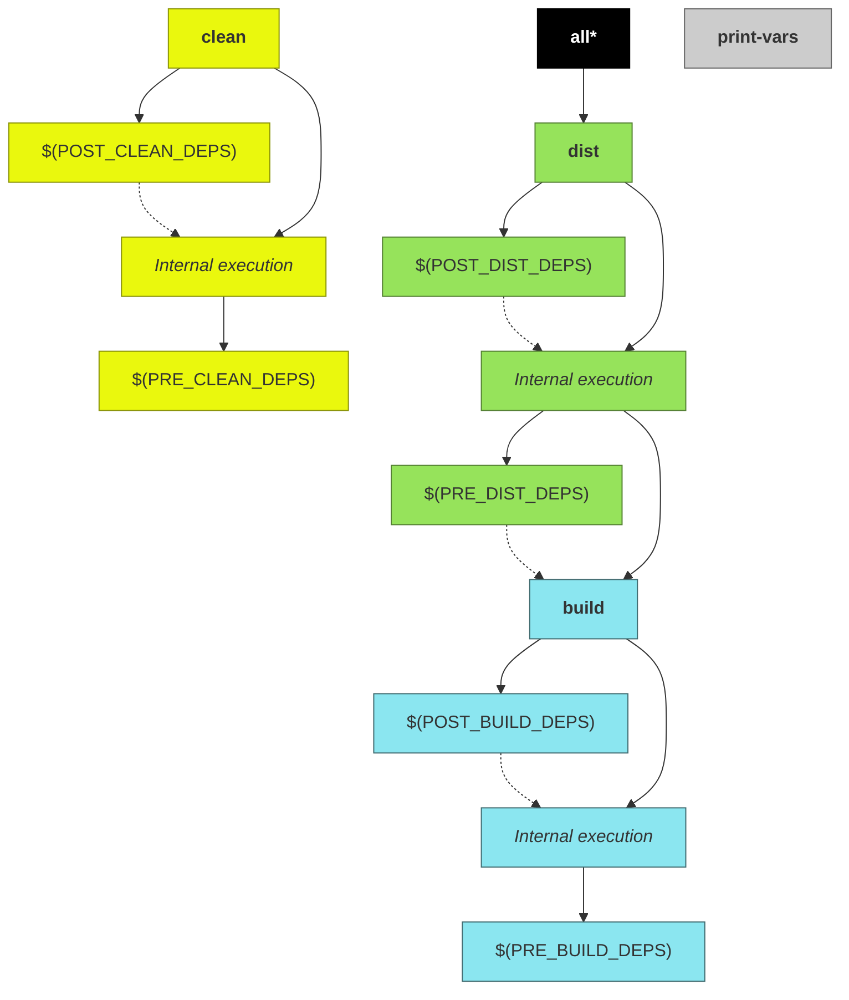

# User guide

This is the main makefile exposed by the cpp-project-builder. It contains standard recipes to build C/C++/Assembly multiplatform projects using a GCC-based compiler.

!!! notes
    Before reading this document, ensure you have read the [basic usage](/#basic-usage) instructions.

## Project name

TODO

## Project type

TODO

## Customizing the build

TODO: Debug, Release, LIB_TYPE, HOST, O, V

## Directories

From this point onwards, the project root directory will be referred to as `<PROJ_ROOT>` and it is the directory where project's `Makefile` is located.

!!! notes
    The absolute path of `<PROJ_ROOT>` cannot have white-spaces.

### Input directories

When present, these directories will be used by the build system with the following purposes:

#### &lt;PROJ_ROOT>/include

Contains platform-independent public includes (header files) used by application during build.

This directory will be added to compiler's [include search path](../variables/#include_dirs).

By default, if project is a [library](../variables/#proj_type), all files contained in this directory will be copied to the [output-directories](#output-directories).

!!! notes "Skip default include source directory"
    THIS IS A FEATURE OF LAST RESORT!

    Default include directory can be ignored by the build through the definition of [`SKIP_DEFAULT_INCLUDE_DIR`](#SKIP_DEFAULT_INCLUDE_DIR) variable.

#### &lt;PROJ_ROOT>/src

Contains platform-independent source files and private headers used by application during build. Any kind of file can be placed into this directory, but only C/C++/Assembly source files will be compiled. The file types are identified according to filename suffixes (values are case-sensitive):

* C sources:**.c**
* C++ sources: **.cpp**, **.cxx**, or **.cc**
* Assembly sources: **.s** or **.S**

This directory is also added to compiler's [include search path](#INCLUDE_DIRS).

> **Skip default source directory**
>
> THIS IS A FEATURE OF LAST RESORT!
>
> Default source directory can be ignored by the build system through the definition of  [`SKIP_DEFAULT_SRC_DIR`](#SKIP_DEFAULT_SRC_DIR) variable.

#### &lt;PROJ_ROOT>/hosts

This directory is assumed to contain platform layers for the project.

For details regarding platform layers, see [multiplatform projects](#multiplatform-projects).

> **Skip default hosts directory**
>
> THIS IS A FEATURE OF LAST RESORT!
>
> Default hosts directory can be ignored by the build system through the definition of [`SKIP_DEFAULT_HOSTS_DIR`](#SKIP_DEFAULT_HOSTS_DIR) variable.

### Output directories

All generated-files produced by the building process are placed into an output base directory (defined by the variable [`O`](#O)). By default, this directory is located into `&lt;PROJ_ROOT>/output/`.

For example, in order to put output files into a directory named `/output/directory`, just override the `O` variable during the call to `make` by passing its value through command line arguments:

```sh
make O=/output/directory
```

!!! notes "Version control"
    The output base directory shall be ignored by your source code version control system if it is located inside your source tree.

Inside output base directory ([`$(O)`](#O)) you will find the following directories (some of them exists only for certain [project types](#PROJ_TYPE)):

#### $(O)/build

Build directory. This directory contains object files as well as final artifact (application executable or library).

This path can be obtained through [`O_BUILD_DIR`](#O_BUILD_DIR) read-only variable and customized through [`BUILD_SUBDIR`](#BUILD_SUBDIR) variable.

#### $(O)/dist

Distribution directory. Final artifact (executable or library), and possibly companion files (e.g. header files, for libraries) are placed into this directory.

This path can be obtained through [`O_DIST_DIR`](#O_DIST_DIR) read-only variable and customized through [`DIST_SUBDIR`](#DIST_SUBDIR) variable.

!!! notes "Additional distribution files"
    Additional directories and/or files to be distributed along with resulting distribution can be added through usage of [`DIST_DIRS`](#DIST_DIRS) and [`DIST_FILES`](#DIST_FILES) variables.

##### $(O)/dist/bin

If project is an [application executable](#PROJ_TYPE), resulting distribution binary will be placed into this directory.

##### $(O)/dist/lib

If project is a [library](#PROJ_TYPE) (either [static or shared](#LIB_TYPE)), resulting binary will be placed into this directory.

##### $(O)/dist/include

If project builds a [library](#PROJ_TYPE) (either [static or shared](#LIB_TYPE)), public headers (if any) will be placed into this directory.

## Multiplatform projects

The build system was created with the concept of platform layers in mind, which means that platform customizations can be made by adding a specifc layer on top of a generic one.

A layer is a directory containing makefile definitions and/or specific source files.

When a [HOST](#HOST) is specified, it will be factored to find supported layers. The value will be splitted by using the dash (`-`) character.

For example, if a [HOST](#HOST) `linux-arm-v6` is given, the following layers can be applicable if the corresponding directories are found in [layer directories](#layer-directories-and-files) (the layers are seached in following order):

* `linux`
* `linux/arm`
* `linux/arm/v6`
* `linux-arm-v6` (NOTE this is a the last applicable layer if present. Usage of this kind of layer is recommended only factorizing the layer does not make sense for your project)

In order to clarify the concepts, lets assume an example project which will be supporting the following hosts: `linux-x64`, and `linux-arm-v7`.

For this example project, the following layers are present (note that layer arrangement is up to the developer):

* `linux`
* `linux/x64`
* `linux/arm`
* `linux/arm/v7`


If you are compiling this example project to `linux-arm-v7` host, select the compilation host through [`HOST`](#HOST) variable. The recommended way is to set the variable through a command line paramenter (although is perfectly legal to hardcode a value into a `&lt;PROJ_ROOT>/Makefile`):

```sh
$ make HOST=linux-arm-v7
```

During the build, the following layers will be applied to this project:

| Layer          | Comments                                                                           |
|----------------|------------------------------------------------------------------------------------|
| `linux`        | _Linux generic definitions_                                                        |
| `linux/arm`    | _Adds specific definitions and/or override definitions of the `linux` layer_       |
| `linux/arm/v7` | _Adds specific definitions and/or override definitions of the `linux/arm` layer_   |

> Note that `linux/x64` layer will be skipped when building the for this host, since it is not a compatible layer.

Similarly, when building to `linux-x64` host, set the [`HOST`](#HOST) variable during the build:

```sh
$ make HOST=linux-x64
```
And the following layers will be applied:


| Layer          | Comments                                                                      |
|----------------|-------------------------------------------------------------------------------|
| `linux`        | _Linux generic definitions_                                                   |
| `linux/x64`    | _Adds specific definitions and/or override definitions of the `linux` layer_  |

> Note that `linux/arm` and `linux/arm/v7` layers will be skipped when building the for this host, since they are not compatible layers.

> **Output directory**
>
> When building a project for multiple platforms in the same build machine, it is recommended to define distinct output directories for each supported host.
>
> For exmple, if your project will be built for linux-x64 and windows-x64 in the same build machine, define disctinct output directories for each platform:
>
> ```sh
> $ make HOST=linux-x64 O=output/linux-x64
> $ make HOST=windows-x64 O=output/windows-x64
> ```

### Layer directories and files

For each supported layer, there is expected to be a subdirectory inside [hosts directory](#default-directories) with a path corresponding to the layer. This location can contain any files/subdirectories, but the following ones have special meaning for the build system:

<a name="layer-src-dir"></a>
* **`&lt;PROJ_ROOT>/hosts/<layer/name>/src/`**

  If present, this directory is expected to contain layer-specific source files, which will be compiled when layer is compatible with selected [`HOST`](#HOST).

  > This directory will also be added to compiler's [include search path](#INCLUDE_DIRS).

<a name="layer-host-mk"></a>
* **`&lt;PROJ_ROOT>/hosts/<layer/name>/host.mk`**

  If present, this makefile will be autoamtically included by the build system when layer is compatible with selected [`HOST`](#HOST). This is useful to add custom build flags and/or libraries for chosen layer.

  For example, while building a project (which has custom makefiles for the layers `linux`, `linux/arm` and `linux/arm/v7`) for the host `linux-arm-v7`, the following sequence of includes will be performed automatically by the build system:

  1. `include &lt;PROJ_ROOT>/hosts/linux/host.mk`
  2. `include &lt;PROJ_ROOT>/hosts/linux/arm/host.mk`
  3. `include &lt;PROJ_ROOT>/hosts/linux/arm/v7/host.mk`

### CROSS_COMPILE variable

When building for a custom target host other than native one, it is required to set the [`CROSS_COMPILE`](#CROSS_COMPILE) variable. This variable must contain the prefix to be added to toolchain binaries. For example, `g++` on a toolchain for `linux-arm` may be called `linux-arm-g++`. In this example, `CROSS_COMPILE` shall be equal to `linux-arm-` (NOTE the trailing dash).

## Linking to external libraries

TODO

## Make targets

The following diagram shows all targets exposed by this makefile and their dependencies:

> NOTE: Dashed arrows represent execution of one target after another (target pointed by the arrow is executed before the target at arrow base), and not a dependency between targets.



### all

Default target. Just depends on [dist](#dist) target.

### clean

Removes all compiled artifacts.

Its internal rules are preceeded by the targets declared in [`PRE_CLEAN_DEPS`](#PRE_CLEAN_DEPS) variable, and are followed by the targets declared in [`POST_CLEAN_DEPS`](#POST_CLEAN_DEPS) variable.

### build

Compiles all source files and generates the target binary artifact (executable application or library).

Its internal rules are preceeded by the targets declared in [PRE_BUILD_DEPS](#PRE_BUILD_DEPS) variable, and are followed by the targets declared in [`POST_BUILD_DEPS`](#POST_BUILD_DEPS) variable.

!!! notes
    If project does not contain source files, no binary artifact will be generated (Howerver, targets declared in [PRE_BUILD_DEPS](#PRE_BUILD_DEPS) and [`POST_BUILD_DEPS`](#POST_BUILD_DEPS) will be executed)

### dist

Generate distribuition tree.

Its internal rules are preceeded by the targets declared in [PRE_DIST_DEPS](#PRE_DIST_DEPS) variable, and followed by dependencies declared on [POST_DIST_DEPS](#POST_DIST_DEPS) variable.

> See [`DIST_DIRS`](#DIST_DIRS) and [`DIST_FILES`](#DIST_FILES) in order to check how to add extra files/directories to the distribution.

### print-vars

This target is used mostly for debugging purposes. It prints the contents of the variables declared in variable [`VARS`](#VARS).

For example, to get the value of both [`SRC_DIRS`](#SRC_DIRS) and [`SRC_FILES`](#SRC_FILES):

```sh
make print-vars VARS='SRC_DIRS SRC_FILES'
```

Generates the following kind of output:

```plain
SRC_DIRS = src
SRC_FILES = src/main.c src/file1.c src/file2.c
```

If `VARS` is undefined, a bunch of variable's values will be displayed.

```sh
make print-vars
```

Output example:

```plain
AR = ar
ARTIFACT = hello0
AS = as
ASFLAGS = -MMD -MP -Isrc -Ioutput/libs/dist/include
CC = gcc
CFLAGS = -MMD -MP -Isrc -Ioutput/libs/dist/include -Wall -O2 -s -DUSE_SHARED_LIB
CROSS_COMPILE =
CXX = g++
CXXFLAGS = -MMD -MP -Isrc -Ioutput/libs/dist/include -Wall -O2 -s
DEBUG = 0
DIST_DIRS =
DIST_FILES =
DIST_MARKER =
HOST = linux-x64
HOSTS_DIRS = /home/user/Desktop/app/make/hosts
INCLUDE_DIRS = src output/libs/dist/include
LD = gcc
LDFLAGS = -s -Loutput/libs/dist/lib -lmylib0
LIB_TYPE = shared
O = output
OPTIMIZE_RELEASE = 1
O_BUILD_DIR = output/build
O_DIST_DIR = output/dist
POST_BUILD_DEPS =
POST_CLEAN_DEPS =
POST_DIST_DEPS =
PRE_BUILD_DEPS = --mylib output/libs/mylib.marker
PRE_CLEAN_DEPS =
PRE_DIST_DEPS =
PROJ_NAME = hello
PROJ_TYPE = app
PROJ_VERSION = 0.1.0
RELEASE_OPTIMIZATION_LEVEL = 2
SKIPPED_SRC_DIRS =
SKIPPED_SRC_FILES =
SKIP_DEFAULT_INCLUDE_DIR = 0
SKIP_DEFAULT_SRC_DIR = 0
SRC_DIRS = src
SRC_FILES = src/main.c
STRIP_RELEASE = 1
V = 0
```

## IDE Integration

### VSCode
