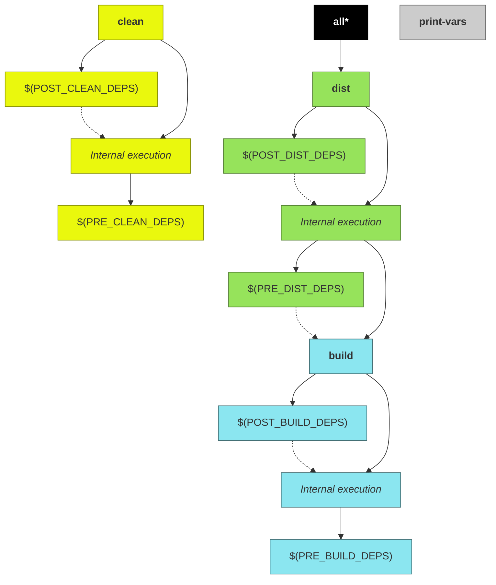

# User guide

Basically, when build system's `builder.mk` is included, it expects certain variables to be defined, and according to their values, the project build process can be customized.

!!! notes
    Before reading this document, ensure you have read the [basic usage](/#basic-usage) instructions.

## Project attributes

### Project name

Every makefile using the build system has to provide a name to the project it refers to. The way in which a project name is defined is via the variable [`PROJ_NAME`](../variables/#proj_name).

The build system will use the project name, among other things, to define the name of artifacts that are generated during the build process.

!!! notes
    The name assigned to generated artifacts may vary according to [selected host](#multiplatform-projects).

    Although it is a good idea to use default generated names, you may change the name of generated artifacts through the use of any of the following variables:

    * [`ARTIFACT`](../variables/#artifact)
    * [`LIB_NAME`](../variables/#lib_name)

### Project type

Along with project name, the project type is required by the build system. It will define what kind of artifact is being built. It can be a library or an application.

In order to define the type of artifact to be built, define the variable [`PROJ_TYPE`](../variables/#proj_type).

If your makefile intends to build a library, you can define the [type of library](#library-type) being built (static or shared). In order to specify the library type, use the variable [`LIB_TYPE`](../variables/#lib_type).

### Project version

On certain platforms, the version number is used to customize the filename of generated artifact. The build system understands a [semantic versioning scheme](https://semver.org/).

In order to set a version to your project, use the variable [`PROJ_VERSION`](../variables/#proj_version). This variable is optional and if it is not defined, a standard value `0.1.0` will be used.

!!! notes "Automatic version from git repository"
    By including the makefile [`git.mk`](../git.mk), you can use one of the exposed variables to be used as your project version.

    For example, let's assume that your project is versioned using git, and releases are tagged using semantic version.

    If you want to use current tag as your project's version, you could create a makefile like this:

        include $(CPB_DIR)/git.mk

        PROJ_NAME = hello
        PROJ_TYPE = lib
        PROJ_VERSION = $(GIT_TAG)

        include $(CPB_DIR)/builder.mk

## Directories and files

From this point onwards, the project root directory will be referred to as `<PROJ_ROOT>` and it is the directory where project's `Makefile` is located.

!!! notes
    The absolute path of `<PROJ_ROOT>` cannot have white-spaces.

### Input directories and files

The build system uses the contents of certain directories to perform the build. Some of these directories are automatically detected by the build system, and others may be manually informed by the project through its makefiles.

Let's discuss first the directories that are automatically detected when present. The presence of such directories is not mandatory:

#### &lt;PROJ_ROOT>/include

This directory is automatically added to compiler's [include search path](../variables/#include_dirs). It is intentended to contain public header files used by the application.

If the project is a library, the contents of this directory will be copied into [distribution directory](#output-directories).

If you want to have multiple directories being added to compiler's search path, add entries to [`INCLUDE_DIRS`](../variables/#include_dirs) variable.

!!! notes ""Low-level" way of adding directories to compiler's include search path"
    The variables [`CFLAGS`](../variables/#cflags) and [`CXXFLAGS`](../variables/#cxxflags) can be used to add extra directories, but keep in mind that use of each variable applies to certain file types ([`CFLAGS`](../variables/#cflags) for C, and [`CXXFLAGS`](../variables/#cxxflags) for C++) and you have to now the exact way of adding directories to compilers' search path.

	For example, in order to pass directories to GCC, you have to use the `-I` parameter. So, in order to pass these parameters to the compilers, add entries like this:

        CFLAGS += -I<dir1> -I<dir2> ...
        CXXFLAGS += -I<dir1> -I<dir2> ...

!!! warning "Skip default include directory detection"
    If the variable [`INCLUDE_DIRS`](../variables/#include_dirs) is defined while including build system's main makefile (`builder.mk`), there will be no automatic detection.

#### &lt;PROJ_ROOT>/src

When present, this directory is intended to have platform-independent source files (or platform-specific, if your project does not mean to support multiple platforms) and private headers used by application during build.

Any kind of file can be placed into this directory, but only C/C++/Assembly source files will be compiled. The file types are identified according their filename suffixes (values are case-sensitive):

* C sources: `*.c`
* C++ sources: `*.cpp`, `*.cxx`, or `*.cc`
* Assembly sources: `*.s` or `*.S`

Addictional source directories and files cann be added by defining the variables [`SRC_DIRS`](../variables/#src_dirs) and/or [`SRC_FILES`](../variables/#src_files).

This directory is also added to compiler's [include search path](../variables/#include_dirs).

!!! warning "Skip default source directory detection"
    Similarly to [`INCLUDE_DIRS`](../variables/#include_dirs), if either [`SRC_DIRS`](../variables/#src_dirs) or [`SRC_FILES`](../variables/#src_files) are defined, the default source directory (`<PROJ_ROOT>/src`) is not automatically detected.

#### &lt;PROJ_ROOT>/hosts

This directory is assumed to contain platform layers for the project.

For details regarding platform layers, see [multiplatform projects](#multiplatform-projects).

> **Skip default hosts directory**
>
> THIS IS A FEATURE OF LAST RESORT!
>
> Default hosts directory can be ignored by the build system through the definition of [`SKIP_DEFAULT_HOSTS_DIR`](#SKIP_DEFAULT_HOSTS_DIR) variable.

### Output directories and files


All generated-files produced by the building process are placed into an output base directory (defined by the variable [`O`](#O)). By default, this directory is located into `&lt;PROJ_ROOT>/output/`.

For example, in order to put output files into a directory named `/output/directory`, just override the `O` variable during the call to `make` by passing its value through command line arguments:

```sh
make O=/output/directory
```

!!! notes "Version control"
    The output base directory shall be ignored by your source code version control system if it is located inside your source tree.

Inside output base directory ([`$(O)`](#O)) you will find the following directories (some of them exists only for certain [project types](#PROJ_TYPE)):

#### $(O)/build

Build directory. This directory contains object files as well as final artifact (application executable or library).

This path can be obtained through [`O_BUILD_DIR`](#O_BUILD_DIR) read-only variable and customized through [`BUILD_SUBDIR`](#BUILD_SUBDIR) variable.

#### $(O)/dist

Distribution directory. Final artifact (executable or library), and possibly companion files (e.g. header files, for libraries) are placed into this directory.

This path can be obtained through [`O_DIST_DIR`](#O_DIST_DIR) read-only variable and customized through [`DIST_SUBDIR`](#DIST_SUBDIR) variable.

!!! notes "Additional distribution files"
    Additional directories and/or files to be distributed along with resulting distribution can be added through usage of [`DIST_DIRS`](#DIST_DIRS) and [`DIST_FILES`](#DIST_FILES) variables.

##### $(O)/dist/bin

If project is an [application executable](#PROJ_TYPE), resulting distribution binary will be placed into this directory.

##### $(O)/dist/lib

If project is a [library](#PROJ_TYPE) (either [static or shared](#LIB_TYPE)), resulting binary will be placed into this directory.

##### $(O)/dist/include

If project builds a [library](#PROJ_TYPE) (either [static or shared](#LIB_TYPE)), public headers (if any) will be placed into this directory.

## Customizing the build

Although you can fully configure the the way in which your project will be built entirely in your project's makefile, there are some aspects that would be more interesting to change just for a specific build.

### Debug vs. Release

By default, built artifacts are generated in release mode (i.e. without any debugging symbols and with some [compiler optimizations](#compiler-optimizations)). If you want to build your artifacts in debug mode (i.e. with debugging symbols and without any compiler optimizations), you have to change the variable [`DEBUG`](../variables/#debug).

It could be perfeclty fine to force every compilation to be in debug mode by setting the corresponding variable in your project's makefile, but it would be more interesting to let the developer or CI/CD system to customize it in the moment the project is being built.

In order to allow customizations, pass the [`DEBUG`](../variables/#debug) variable as command-line arguments during the build:

```bash
make DEBUG=1
```

### Compiler optimizations

When your project is being built in [debug mode](#debug-vs-release), by default no compiler optmizations would be applied. In the other hand, when your project is being built in release mode (this is the default mode), some compiler optimizations will be applied and binaries will be stripped by default.

If you want to customize the optimizations done while building in release mode, the following variables can be used:

* [`STRIP_RELEASE`](../variables/#strip_release)
* [`OPTIMIZE_RELEASE`](../variables/#optimize_release)
* [`RELEASE_OPTMIZATION_LEVEL`](../variables/#release_optimization_level)

### Library type

When building a library, two kinds of artifacts can be built: _shared libraries_ or _static libraries_.

The library type is set through the variable [`LIB_TYPE`](../variables/#lib_type).

Although it would be perfectly fine to enforce (via makefiles) the generated library type to be of a certain kind, it is more interesting to let the the type to be defined during build time.

For example, if you want to generate an **static** library in **debug** mode, call `make` defining associated variables as command-line args:

```bash
make LIB_TYPE=static DEBUG=1
```

### Verbose mode

By default, when your project is being built, only basic output is generated by the build system.

This is a typical output generated during a build:

```plain
[CC] output/linux-x64/release/build/src/main.c.o
[LD] output/linux-x64/release/build/hello
[DIST] output/linux-x64/release/dist/bin/hello
```

If you want to see the real commands and corresponding flags while compiling/linking files, enable the **verbose mode** by setting the variable [`V`](../variables/#v):

```bash
make V=1
```

This is the output generated while building the same project from above:

```plain
[CC] output/linux-x64/release/build/src/main.c.o
gcc -MMD -MP -Isrc -Wall -O2 -s -c src/main.c -o output/linux-x64/release/build/src/main.c.o

[LD] output/linux-x64/release/build/hello
gcc -o output/linux-x64/release/build/hello output/linux-x64/release/build/src/main.c.o -s

[DIST] output/linux-x64/release/dist/bin/hello
/bin/cp output/linux-x64/release/build/hello output/linux-x64/release/dist/bin/hello
```

!!! note "Checking compiler flags and variable values"
    If you want to check what would be the values used by the build system
    without actually triggering the build, use the make target [`print-vars`](#print-vars)

### Output directory

See [output directories](#output-directories).

### Selecting a host

See [multiplatform projects](#multiplatform-projects).


## Make targets

The following diagram shows all targets exposed by this makefile and their dependencies:

!!! note
    Dashed lines represent execution of one target after another, and not a dependency between them.



### all

Default target. Just depends on [dist](#dist) target.

### clean

Removes all compiled artifacts.

Its internal rules are preceeded by the targets declared in [`PRE_CLEAN_DEPS`](#PRE_CLEAN_DEPS) variable, and are followed by the targets declared in [`POST_CLEAN_DEPS`](#POST_CLEAN_DEPS) variable.

### build

Compiles all source files and generates the target binary artifact (executable application or library).

Its internal rules are preceeded by the targets declared in [PRE_BUILD_DEPS](#PRE_BUILD_DEPS) variable, and are followed by the targets declared in [`POST_BUILD_DEPS`](#POST_BUILD_DEPS) variable.

!!! notes
    If project does not contain source files, no binary artifact will be generated (Howerver, targets declared in [PRE_BUILD_DEPS](#PRE_BUILD_DEPS) and [`POST_BUILD_DEPS`](#POST_BUILD_DEPS) will be executed)

### dist

Generate distribuition tree.

Its internal rules are preceeded by the targets declared in [PRE_DIST_DEPS](#PRE_DIST_DEPS) variable, and followed by dependencies declared on [POST_DIST_DEPS](#POST_DIST_DEPS) variable.

> See [`DIST_DIRS`](#DIST_DIRS) and [`DIST_FILES`](#DIST_FILES) in order to check how to add extra files/directories to the distribution.

### print-vars

This target is used mostly for debugging purposes. It prints the contents of the variables declared in variable [`VARS`](#VARS).

For example, to get the value of both [`SRC_DIRS`](#SRC_DIRS) and [`SRC_FILES`](#SRC_FILES):

```sh
make print-vars VARS='SRC_DIRS SRC_FILES'
```

Generates the following kind of output:

```plain
SRC_DIRS = src
SRC_FILES = src/main.c src/file1.c src/file2.c
```

If `VARS` is undefined, a bunch of variable's values will be displayed.

```sh
make print-vars
```

Output example:

```plain
AR = ar
ARTIFACT = hello0
AS = as
ASFLAGS = -MMD -MP -Isrc -Ioutput/libs/dist/include
CC = gcc
CFLAGS = -MMD -MP -Isrc -Ioutput/libs/dist/include -Wall -O2 -s -DUSE_SHARED_LIB
CROSS_COMPILE =
CXX = g++
CXXFLAGS = -MMD -MP -Isrc -Ioutput/libs/dist/include -Wall -O2 -s
DEBUG = 0
DIST_DIRS =
DIST_FILES =
DIST_MARKER =
HOST = linux-x64
HOSTS_DIRS = /home/user/Desktop/app/make/hosts
INCLUDE_DIRS = src output/libs/dist/include
LD = gcc
LDFLAGS = -s -Loutput/libs/dist/lib -lmylib0
LIB_TYPE = shared
O = output
OPTIMIZE_RELEASE = 1
O_BUILD_DIR = output/build
O_DIST_DIR = output/dist
POST_BUILD_DEPS =
POST_CLEAN_DEPS =
POST_DIST_DEPS =
PRE_BUILD_DEPS = --mylib output/libs/mylib.marker
PRE_CLEAN_DEPS =
PRE_DIST_DEPS =
PROJ_NAME = hello
PROJ_TYPE = app
PROJ_VERSION = 0.1.0
RELEASE_OPTIMIZATION_LEVEL = 2
SKIPPED_SRC_DIRS =
SKIPPED_SRC_FILES =
SKIP_DEFAULT_INCLUDE_DIR = 0
SKIP_DEFAULT_SRC_DIR = 0
SRC_DIRS = src
SRC_FILES = src/main.c
STRIP_RELEASE = 1
V = 0
```

## Multiplatform projects

The build system was created with the concept of platform layers in mind, which means that platform customizations can be made by adding a specifc layer on top of a generic one.

A layer is a directory containing makefile definitions and/or specific source files.

When a [HOST](#HOST) is specified, it will be factored to find supported layers. The value will be splitted by using the dash (`-`) character.

For example, if a [HOST](#HOST) `linux-arm-v6` is given, the following layers can be applicable if the corresponding directories are found in [layer directories](#layer-directories-and-files) (the layers are seached in following order):

* `linux`
* `linux/arm`
* `linux/arm/v6`
* `linux-arm-v6` (NOTE this is a the last applicable layer if present. Usage of this kind of layer is recommended only factorizing the layer does not make sense for your project)

In order to clarify the concepts, lets assume an example project which will be supporting the following hosts: `linux-x64`, and `linux-arm-v7`.

For this example project, the following layers are present (note that layer arrangement is up to the developer):

* `linux`
* `linux/x64`
* `linux/arm`
* `linux/arm/v7`


If you are compiling this example project to `linux-arm-v7` host, select the compilation host through [`HOST`](#HOST) variable. The recommended way is to set the variable through a command line paramenter (although is perfectly legal to hardcode a value into a `&lt;PROJ_ROOT>/Makefile`):

```sh
$ make HOST=linux-arm-v7
```

During the build, the following layers will be applied to this project:

| Layer          | Comments                                                                           |
|----------------|------------------------------------------------------------------------------------|
| `linux`        | _Linux generic definitions_                                                        |
| `linux/arm`    | _Adds specific definitions and/or override definitions of the `linux` layer_       |
| `linux/arm/v7` | _Adds specific definitions and/or override definitions of the `linux/arm` layer_   |

> Note that `linux/x64` layer will be skipped when building the for this host, since it is not a compatible layer.

Similarly, when building to `linux-x64` host, set the [`HOST`](#HOST) variable during the build:

```sh
$ make HOST=linux-x64
```
And the following layers will be applied:


| Layer          | Comments                                                                      |
|----------------|-------------------------------------------------------------------------------|
| `linux`        | _Linux generic definitions_                                                   |
| `linux/x64`    | _Adds specific definitions and/or override definitions of the `linux` layer_  |

> Note that `linux/arm` and `linux/arm/v7` layers will be skipped when building the for this host, since they are not compatible layers.

> **Output directory**
>
> When building a project for multiple platforms in the same build machine, it is recommended to define distinct output directories for each supported host.
>
> For exmple, if your project will be built for linux-x64 and windows-x64 in the same build machine, define disctinct output directories for each platform:
>
> ```sh
> $ make HOST=linux-x64 O=output/linux-x64
> $ make HOST=windows-x64 O=output/windows-x64
> ```

### Layer directories and files

For each supported layer, there is expected to be a subdirectory inside [hosts directory](#default-directories) with a path corresponding to the layer. This location can contain any files/subdirectories, but the following ones have special meaning for the build system:

<a name="layer-src-dir"></a>
* **`&lt;PROJ_ROOT>/hosts/<layer/name>/src/`**

  If present, this directory is expected to contain layer-specific source files, which will be compiled when layer is compatible with selected [`HOST`](#HOST).

  > This directory will also be added to compiler's [include search path](#INCLUDE_DIRS).

<a name="layer-host-mk"></a>
* **`&lt;PROJ_ROOT>/hosts/<layer/name>/host.mk`**

  If present, this makefile will be autoamtically included by the build system when layer is compatible with selected [`HOST`](#HOST). This is useful to add custom build flags and/or libraries for chosen layer.

  For example, while building a project (which has custom makefiles for the layers `linux`, `linux/arm` and `linux/arm/v7`) for the host `linux-arm-v7`, the following sequence of includes will be performed automatically by the build system:

  1. `include &lt;PROJ_ROOT>/hosts/linux/host.mk`
  2. `include &lt;PROJ_ROOT>/hosts/linux/arm/host.mk`
  3. `include &lt;PROJ_ROOT>/hosts/linux/arm/v7/host.mk`

### CROSS_COMPILE variable

When building for a custom target host other than native one, it is required to set the [`CROSS_COMPILE`](#CROSS_COMPILE) variable. This variable must contain the prefix to be added to toolchain binaries. For example, `g++` on a toolchain for `linux-arm` may be called `linux-arm-g++`. In this example, `CROSS_COMPILE` shall be equal to `linux-arm-` (NOTE the trailing dash).

## Linking to external libraries

TODO

## IDE Integration

### VSCode
